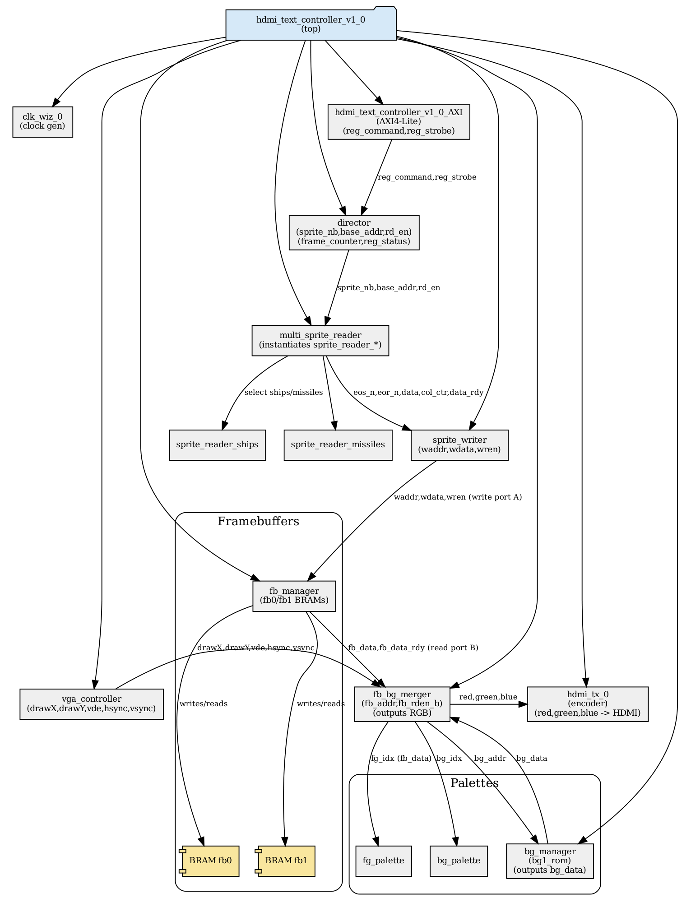

← [Back to project root](../README.md)

## Diagrams

	
	 
	<em>Figure 1: MicroBlaze SoC block diagram, custom IP in red</em>

	
	 
	<em>Figure 2: Custom IP datapath</em>

# Hardware Overview

## Structure
- [`ip/custom`](ip/custom/README.md) – custom video card IP, main deliverable
- [`ip/vendor`](ip/vendor/README.md) – Xilinx / RealDigital IP
- [`mb_bd`](mb_bd/README.md) – MicroBlaze system
- [`top`](top/README.md) – top-level SV integration
