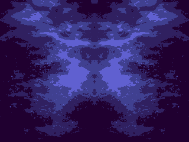
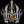
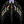
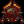
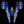
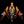

← [Back to IP overview](../README.md)  
← [Back to project root](../../../README.md)

# Custom Video Card IP

## Overview
Custom FPGA video card IP implementing a sprite-based rendering pipeline
with AXI-Lite control and dual framebuffers.

## Source Code & Verification (Core of This Project)

- [`src/`](src/) — SystemVerilog RTL implementation
- [`tb/`](tb/) — SystemVerilog testbenches (**primary engineering focus**)

## Sprite Assets

- [COE files](sprites/coe/)
- [PNG sources](sprites/png/)
- [Generated ROM IP](sprites/roms/)

### Sprite Visuals (PNG ↔ COE)

Below are the sprite PNGs, scaled up for visibility, with their corresponding COE files:

<table>
	<tr>
		<th>COE File</th>
		<th>Sprite Image (PNG)</th>
	</tr>
	<tr>
		<td>bg1.COE</td>
		<td></td>
	</tr>
	<tr>
		<td>missile1.COE</td>
		<td></td>
	</tr>
	<tr>
		<td>ships1.COE</td>
		<td></td>
	</tr>
	<tr>
		<td>ships2.COE</td>
		<td></td>
	</tr>
	<tr>
		<td>ships3.COE</td>
		<td></td>
	</tr>
	<tr>
		<td>ships4.COE</td>
		<td></td>
	</tr>
	<tr>
		<td>ships5.COE</td>
		<td></td>
	</tr>
	<tr>
		<td>ships6.COE</td>
		<td></td>
	</tr>
	<tr>
		<td>test_rom_missile.COE</td>
		<td><em>No corresponding PNG image. Test ROM for missile sprite data.</em></td>
	</tr>
	<tr>
		<td>test_rom.COE</td>
		<td><em>No corresponding PNG image. Test ROM for general sprite data.</em></td>
	</tr>
</table>

### [`src/`](src/) — SystemVerilog RTL implementation

- [bg_manager.sv](src/bg_manager.sv): Background layer manager for sprite/background composition
- [bg_palette.sv](src/bg_palette.sv): Background palette RAM or logic
- [director.sv](src/director.sv): Top-level rendering pipeline director/controller
- [fb_bg_merger.sv](src/fb_bg_merger.sv): Merges framebuffer and background data
- [fb_manager.sv](src/fb_manager.sv): Framebuffer memory manager
- [fg_palette.sv](src/fg_palette.sv): Foreground palette RAM or logic
- [hdmi_text_controller_v1_0_AXI.sv](src/hdmi_text_controller_v1_0_AXI.sv): AXI-Lite interface for HDMI text controller
- [hdmi_text_controller_v1_0.sv](src/hdmi_text_controller_v1_0.sv): HDMI text rendering controller
- [multi_sprite_reader.sv](src/multi_sprite_reader.sv): Reads and processes multiple sprites per frame
- [sprite_reader_missiles.sv](src/sprite_reader_missiles.sv): Sprite reader specialized for missiles
- [sprite_reader_ships.sv](src/sprite_reader_ships.sv): Sprite reader specialized for ships
- [sprite_writer.sv](src/sprite_writer.sv): Writes sprite data to memory/framebuffer
- [vga_controller.sv](src/vga_controller.sv): VGA signal generation and timing controller

### [`tb/`](tb/) — SystemVerilog testbenches

- [clock_wiz_sim.sv](tb/clock_wiz_sim.sv): Simulation testbench for clock wizard IP
- [director_tb.sv](tb/director_tb.sv): Testbench for the director module
- [hdmi_text_controller_v1_0_sim.sv](tb/hdmi_text_controller_v1_0_sim.sv): Simulation for HDMI text controller
- [hdmi_text_controller_v1_0_tb-orginal.sv](tb/hdmi_text_controller_v1_0_tb-orginal.sv): Original testbench for HDMI text controller
- [hdmi_text_controller_v1_0_tb.sv](tb/hdmi_text_controller_v1_0_tb.sv): Main testbench for HDMI text controller
- [hdmi_tx_0_sim.sv](tb/hdmi_tx_0_sim.sv): Simulation for HDMI transmitter IP
- [new_top_ip_internal_tb.sv](tb/new_top_ip_internal_tb.sv): Testbench for top-level IP integration
- [sprite_catalog_tb.sv](tb/sprite_catalog_tb.sv): Testbench for sprite catalog logic

## Sprite Assets

- [COE files](sprites/coe/)
- [PNG sources](sprites/png/)
- [Generated ROM IP](sprites/roms/)
